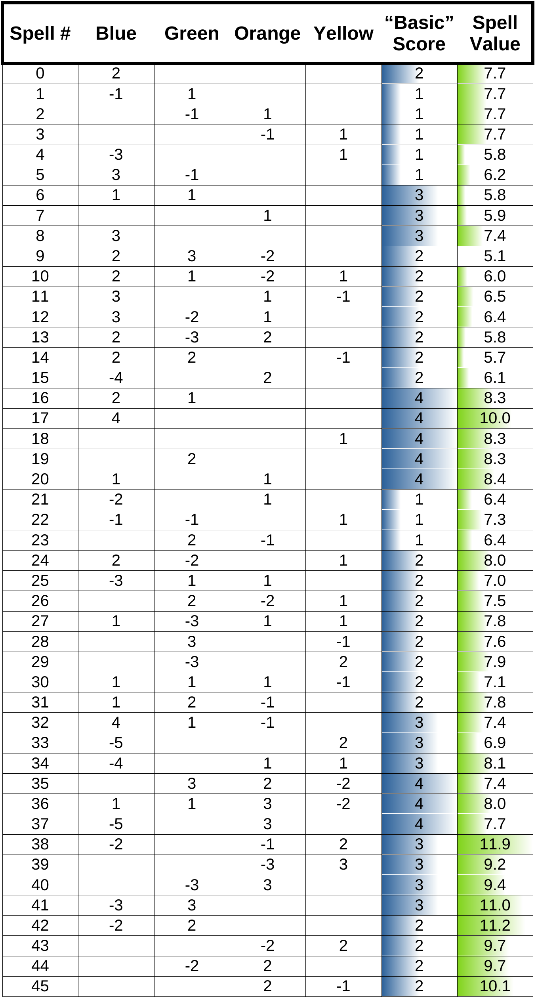

# Fall Challenge 2020
A Post-Mortem by pb4

Winner of the Codingame challenge - November 2020  

Link to the contest rules: https://www.codingame.com/multiplayer/bot-programming/fall-challenge-2020
Link to the leaderboard: https://www.codingame.com/contests/fall-challenge-2020/leaderboard/global

# Introduction
As usual, many thanks to the Codingame team for organizing this contest! I loved the rules at first sight, and seeing there were more than 7k participants I was not alone!

Straight to the point: as for many other contestants, my AI mainly uses Beam Search to find long sequences of moves that score many points.

Towards the end of the contest I added special code for two phases of the game where opponent interaction is important *and manageable*: the early-game and the end-game.

In order to keep things short, this post will concentrate on the *little things* that I believe made my AI better than others.

Over the duration of the contest, I made heavy use of a local arena to evaluate candidate improvements. When the information is available, the effect of improvements will be evaluated in terms of ELO score. +10 ELO is equivalent to a change from 50% winrate to 51.4% winrate. +100 ELO is equivalent to 50% -> 64% winrate.

Over the last 5 days of the contest, I was able to find approximately +200 ELO worth of improvements to my code. Some of it in big features, a lot of it in parameter tweaking... There was a relatively good (as far as I can tell...) correlation between local improvements and online improvements.

# Early-game: Draft phase
Three possibilities were considered for the draft phase.
1. Let the mid-game algorithm handle LEARN *(base ELO)*
2. Systematically LEARN the first spell available *(+30 ELO)*
3. [DUCT](http://mlanctot.info/files/papers/cig14-smmctsggp.pdf) search with LEARN only *(+40 ELO)*

While surprising to me at first, the improvement from 1) to 2) is expected as [online strategy guides](https://spicee.mattle.online/lobby/forum/topic/d52WjBx3WX3R27rzy/a-player-s-guide-to-spicee) do recommend to spend the early game assembling a good set of spells. Potions and ingredients may be advantageously neglected during this draft phase.

Seeing how the draft phase may have such a strong overall ELO impact, I implemented a simultaneous DUCT search with the objective to maximize the future value of spells that will have been learned after 6 turns. This required estimating said "future value of spells".

This future value was computed the following way:
1. Generate a game where a player is given 7 random spells. No new spells may be learned in the future.
2. Play 22 turns (typical mid- and end-game duration in a normal game) and record the number of points gathered by the player.
3. Store the information that "this spell contributed to X points"
4. Go back to 1), repeat 500k times.
5. For each spell, export the average points obtained when the spell was available.

With a little bit of math, the individual spell values are extracted:

A similar approach can be used to estimate "combo values": cards which work better or worse together than estimated from there individual spell values.

I was really pleased to find that the strongest combos found with this approach were the same that were mentionned in this [strategy guides](https://spicee.mattle.online/lobby/forum/topic/d52WjBx3WX3R27rzy/a-player-s-guide-to-spicee) .

Without going into more details:
- These score are expressed in terms of *rupees earned per spell per 22 turns* so that they can easiliy be integrated within a normal evaluation function. 
- While I also evaluated the marginal decrease of spell value everytime a new spell is learnt, I did not use this information.

# Mid-game: 

A very standard beam search (width = 400) described by everybody else in their Post-Mortem. While the early- and end-game additions made the little difference that pushed me to the top, the beam search alone is sufficient to rank within the top10.

I have to admit I am still puzzled why my beam search worked better than all but 10 other contestants, because there is absolutely nothing fancy about it. 

In no particular order:
- evaluation if the game is ongoing : *tier0 + 2&ast;tier1 + 3&ast;tier2 + 4&ast;tier3 + potionsScore*
- evaluation if the game is finished : something *very big* if I win, *very small* if I lose, don't care about points
- potionsScore is the sum of *rupeesEarned &ast; 0.99 ^ turnPotionWasBrewed*
- spells learned and their castable status is *not* taken into account
- a 10ms search is run for the opponent:
 - Potions are marked as unvailable in the search for my move once I believe the opponent will have taken them (+5 ELO)
 - Small 1-rupee bonus for taking a potion before I believe the opponent will have taken it (+5 ELO)
 - I tried to simulate his first action in the search for my move, but failed (-10 ELO). I still do not understand why that might fail...
 - and that's it...
        
Surprises:
 - Everybody talking about performance being important. On the contrary, I found that above a certain threshold (approx. 30k simulations), there was no benefit to have a faster code. There is exactly 0 ELO difference between my code and itself capped at 50% simulation time.
 - Everybody talking about fine-tuned evaluation functions
 - Larger beam width (400 to 600) at same depth = worse ranking (-15 ELO !!). Test everything...  

# End-game: 
When the end-game is near, the beam-search is disabled and replaced by another [DUCT](http://mlanctot.info/files/papers/cig14-smmctsggp.pdf) search, in which all LEARN actions are disabled.
This prevents silly losses where the potion is brewed but the opponent accumulates a lot of tier > 0 ingredients. In fact, it outputs something which approximates (with no theoretical guarantee) the optimal mixed strategy.
