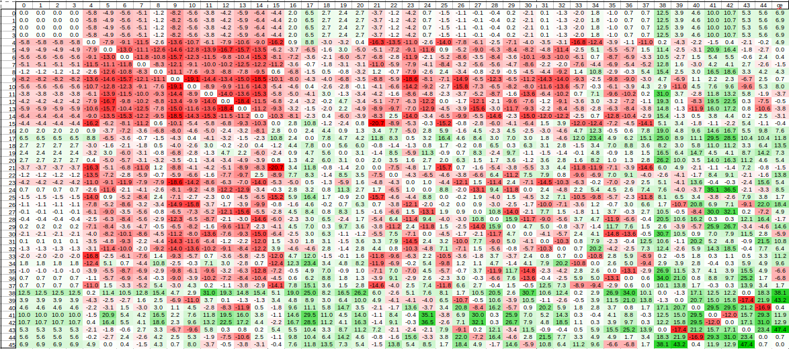

# Fall Challenge 2020
A Post-Mortem by pb4

Winner of the Codingame challenge - November 2020  

Link to the contest rules: (to be updated)
Link to the leaderboard: https://www.codingame.com/contests/fall-challenge-2020/leaderboard/global

# Introduction
Straight to the point: as for many other participants, my AI mainly uses Beam Search to find long sequences of moves that score many points.

Towards the end of the contest I added special code for two phases of the game where opponent interaction is important *and manageable*: the early-game and the end-game.

In order to keep things short, this post will concentrate on the *little things* that I believe made my AI better than others.

Over the duration of the contest, I made heavy use of a local arena to evaluate candidate improvements. When the information is available, the effect of improvements will be evaluated in terms of ELO score. +10 ELO is equivalent to a change from 50% winrate to 51.4% winrate. +100 ELO is equivalent to 50% -> 64% winrate.

# Early-game: Draft phase
Three possibilities were considered for the draft phase.
1. Let the mid-game algorithm handle LEARN *(base ELO)*
2. Systematically LEARN the first spell available *(+30 ELO)*
3. [DUCT](http://mlanctot.info/files/papers/cig14-smmctsggp.pdf) search with LEARN only *(+40 ELO)*

While surprising to me at first, the improvement from 1) to 2) is expected as [online strategy guides](https://spicee.mattle.online/lobby/forum/topic/d52WjBx3WX3R27rzy/a-player-s-guide-to-spicee) do recommend to spend the early game assembling a good set of spells. Potions and ingredients may be advantageously neglected during this draft phase.

Seeing how the draft phase may have such a strong overall ELO impact, I implemented a simultaneous DUCT search with the objective to maximize the future value of spells that will have been learned after 6 turns. This required estimating said "future value of spells".

This future value was computed the following way:
1. Generate a game where a player is given 7 random spells. No new spells may be learned in the future.
2. Play 22 turns (typical mid- and end-game duration in a normal game) and record the number of points gathered by the player.
3. Store the information that "this spell contributed to X points"
4. Go back to 1), repeat 500k times.
5. For each spell, export the average points obtained when the spell was available.

With a little bit of math, the individual spell values are extracted:

A similar approach can be used to estimate "combo values": cards which work better or worse together than estimated from there individual spell values.

I was really pleased to find that the strongest combos found with this approach were the same that were mentionned in this [strategy guides](https://spicee.mattle.online/lobby/forum/topic/d52WjBx3WX3R27rzy/a-player-s-guide-to-spicee) .

# Mid-game: 

# End-game: 

Note : performance & heuristics
